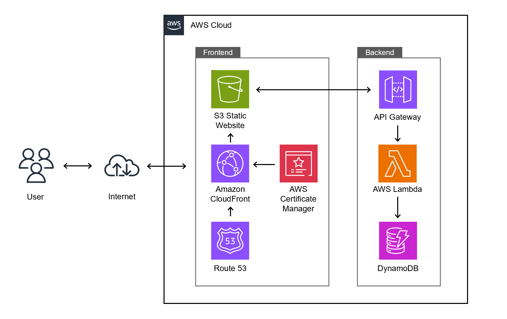

# [Cloud Resume](https://www.patipholpun-cloud.com)

## Overview

The Cloud Resume [Pun Resume](https://www.patipholpun-cloud.com) showcases the use of AWS services to deploy a highly available, and scalable personal resume website. This project integrates multiple AWS services.

## Features

- **Static Website Hosting:** A resume website hosted in an S3 bucket and distributed globally through CloudFront with Origin Access Control (OAC).
- **Custom Domain:** Route 53 manages domain name configurations, including MX records for domain email.
- **Visitor Tracking:** Tracks website visitors using a serverless backend with REST API Gateway, Lambda, and DynamoDB.

## Project Architecture

## Future Improvements

- Utilizes Terraform to provision and manage AWS resources.
- GitHub Actions automates the deployment process for frontend updates.
- Integrates CloudWatch, PagerDuty, Slack, and Jira for comprehensive monitoring and incident management.
- Implement a resume download option.
- Add DNSSEC for enhanced domain security.
